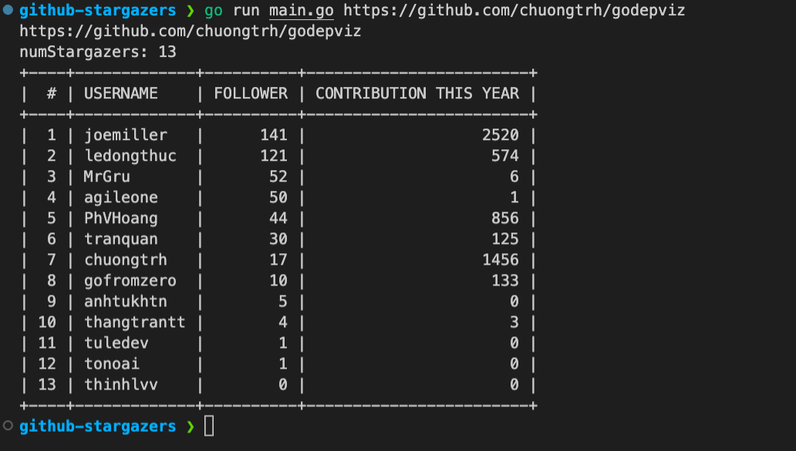

Show top 100 list stargazers starred your repository including followers & contributions.

## Usage

Run a command

```sh
$ go run main https://github.com/<username>/<repository>
```

Example:

```sh
$ go run main.go https://github.com/chuongtrh/godepviz
```



## Tip & Trick

- Github only shows a maximum of 5K followers in tab followers
- Using HTTP to crawl HTML content and parser to get the number of followers & contributions
- Rate limit
  GitHub API rate limit is [60 requests per hour.](https://docs.github.com/en/rest/overview/resources-in-the-rest-api#requests-from-personal-accounts) . That why using google translate to increase more rate limit.
